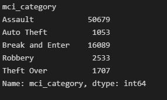
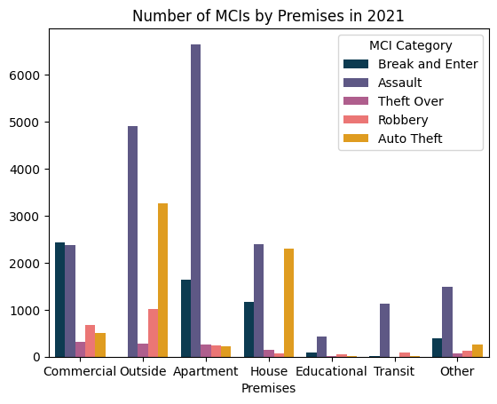
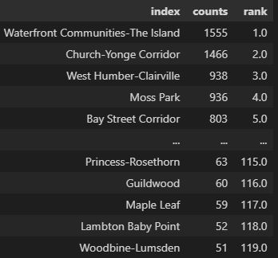
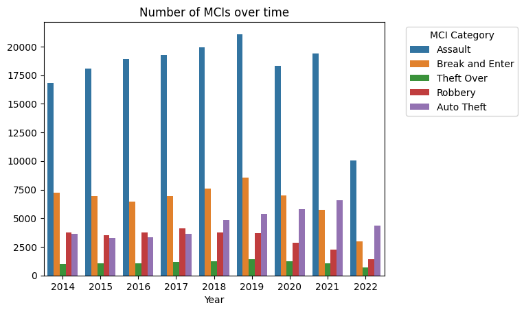

# Toronto-Crime-Statistics
**Preface:**

Have you been noticing a dramatic uptick in catalytic converter crimes in your area? Maybe that is all the local news and your local subreddit seem to be talking about. Of course, you have! And it is with this thought in mind, that I wondered if this was actually true, and if it could be visualized with data. Unfortunately, Edmonton police records did not appear to be public data, however, they were provided in Toronto. As someone interested in potentially moving there one day (when real estate prices aren't crazy), the initial question was transformed to apply to Toronto and discover other insights that may be of value to prospective migrants.

**Task:**

To analyze police crime data to identify trends and apply them to typical considerations of prospective migrants and provide recommendations based on findings.

Audience – Prospective Migrants, Locals who may cross-validate findings

**Data:**

The data used in this case was pulled from the Toronto Police Public Safety Portal. The dataset was pulled from Open Data on reported crimes for all major crime indicators. The dataset contains 301,233 rows and 30 total columns. The description of each column is as follows:

| Column | Description |
| --- | --- |
| X | Coordinates on the x-axis |
| Y | Coordinates on the y-axis |
| Index | Sequential Entries into Dataset |
| event\_unique\_id | The assigned ID of the event |
| Division | Police Division Code |
| occurrencedate | Date where the event happened |
| reporteddate | Date when the event was reported |
| Location | Location where the event happened |
| premises | Categories of location |
| ucr\_code | Code assigned to offence category |
| ucr\_ext | Extension of code for the specific offence |
| offence | The crime that happened |
| reportedyear | Year of report |
| reportedmonth | Name of month during report |
| reporteddayofyear | Day of report |
| reportedhour | Hour of day in report as int |
| occurrenceyear | Year of event |
| occurrencemonth | Name of month during event |
| occurrencedayofyear | Day of event |
| occurrencehour | Hour of day for event as int |
| mci\_category | Category of crime |
| Hood\_id | Neighbourhood id |
| neighbourhood | Name of neighbourhood |
| longitude | Coordinates in longitude |
| latitude | Coordinates in latitude |
| Objectid | ID of report |

**Data Integrity Biases:**

The data was collected via an electronic recording system and has been cleaned prior to upload. All records should have been recorded in this dataset from the year 2014 to 2022 with the exception of homicides and shooting crimes. The dataset also finished recordings in June 2022, thus not completely encapsulating the year 2022. This dataset also includes unreported crimes; thus, generalizability would be affected as we do not know the ratio of unreported to reported crimes.

**Processing:**

For a functional approach, data cleaning and analysis was performed using Python using the NumPy, pandas, and seaborn packages.

**Data Cleaning and Analysis:**

[-You can find the code Here-](https://github.com/4jlow/Toronto-Crime-Statistics/blob/master/Toronto%20Crime%20EDA.ipynb)

**Relevant Findings:**

**Assaults make up over 2/3rds of reported crimes** :

However, this does not mean that they are the most prevalent crime, only that non-assault-based crimes such as theft aren't as commonly reported.

**Most Assaults Occur in Apartments:**

The population split between apartments and houses is approximately 55:45. However, there are far more assaults in apartments. The next highest premise for assaults is outside, thus we might suspect that areas of frequent human interaction also increase the frequency of assault. Auto theft is incredibly low in apartment complexes, but this is most likely due to apartments having their own protected parking areas rather than apartment residents not owning a vehicle.

**Some communities are much safer than others:**

In 2021, the 5 neighborhoods where the most crimes were reported were: The Island, Church-Yonge Corridor, West Humber-Clairville, Moss Park, and Bay Street Corridor, while the neighborhoods with the least crime reported are: Princess-Rosethorn, Guildwood, Maple Leaf, Lambton Baby Point, Woodbine-Lumsden.

**Auto theft is trending upwards:**

All other theft has remained rather constant, however with the advent of the covid-19 pandemic and restrictions. Assaults had gone down slightly (probably due to lower in-person interaction), but not by much. Also, categories such as breaking and entering and robbery have also trended down, which could be explained via reduced opportunity as more individuals are staying home. On the flip side, auto thefts have been on the rise, and quarantine measures have done nothing to change that.

As for the year 2022, only the data for half the year has been collected so far, however, it appears to already be eclipsing previous years. This could present new hypotheses such as thieves not coming out during the winter months, or theft trending upwards due to businesses opening back up again.

**Closing Recommendations:**

So, you are interested in moving to Toronto. Naturally, your biggest concern apart from commute time and cost of living is your own personal safety. Since Toronto is a fairly metro city, you might be thinking about living in an apartment. Most apartments have secure parking lots, but you might also be commuting, so auto theft isn't a dealbreaker for you. So just based on assaults, the safest neighborhoods for the year 2021 would be:

- Princess-Rosethorn
- Lawrence Park North
- Guildwood
- Kingsway South
- Centennial Scarsborough

While neighborhoods to avoid would be as follows:

- Waterfront Communities-The Island
- Moss Park
- Church-Yonge Corridor
- North St.James Town
- Downsview-Roding-CFB

These are just subjective rankings and are subjective to both the methodology used and the data from which the rankings were drawn. The results of data analysis may not accurately reflect the actual situation because the data itself may be incomplete, biased, or otherwise flawed. Factors such as sampling error, measurement error, and missing data can all affect the validity of the results. It is important to be aware of these potential sources of error and to carefully consider the limitations of the data when interpreting the results of an analysis.

To have a look at the rankings for yourself, [-please go here-](https://github.com/4jlow/Toronto-Crime-Statistics/blob/master/data/2021%20Crime%20Rankings.csv)
